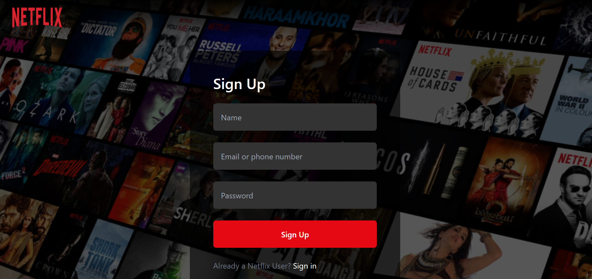
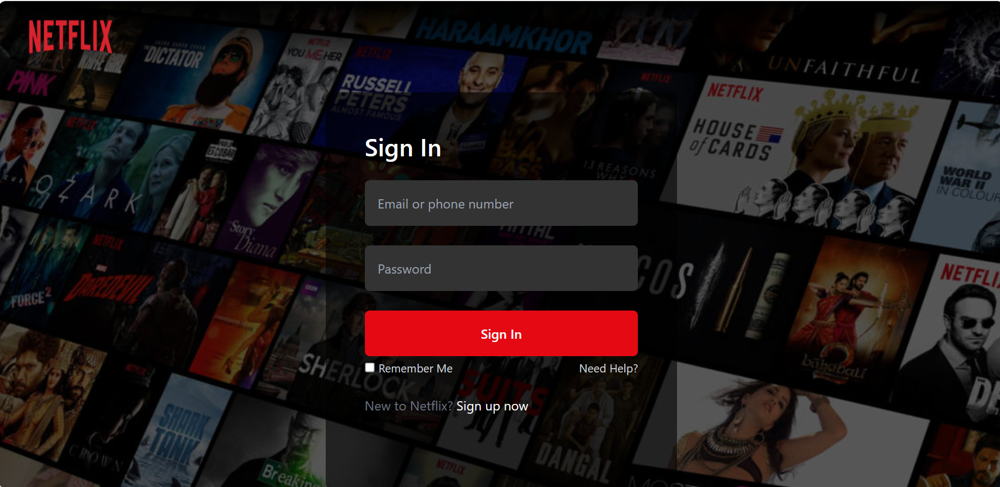
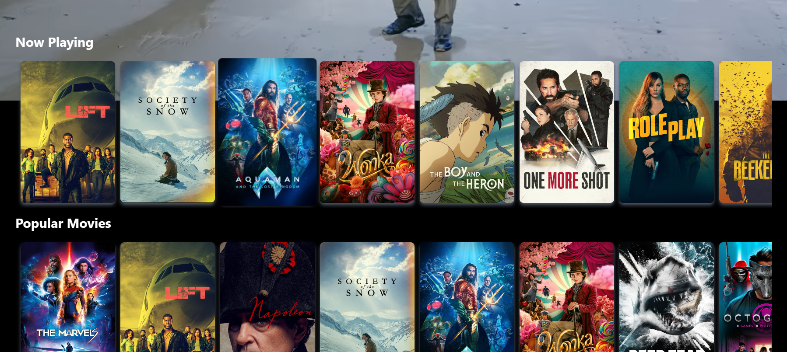
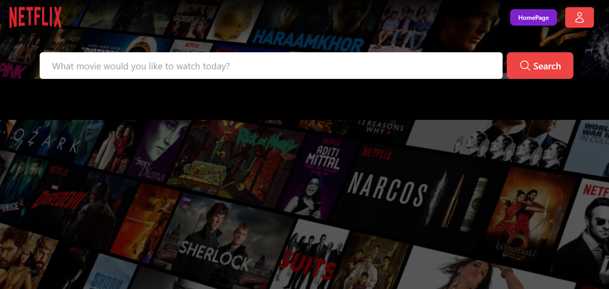
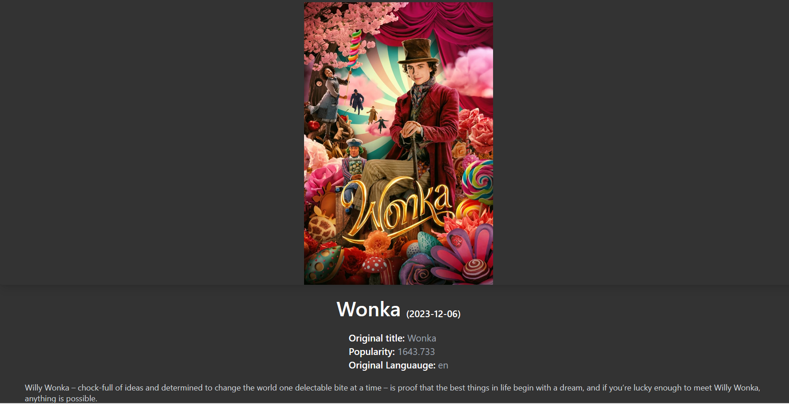

# OTT-Platform with Movie Recommendation









## Demo
Check out the live demo: [Netflix Clone Demo](https://ott-platform-d5cf6.web.app/)

## Technologies Used
- React
- React Router
- Tailwind CSS
- Node.js
- GPT API
- TMDB API

## Installation
1. Clone the repository: `git clone https://github.com/AnandRoy8121/ott-platform.git`
2. Navigate to the project directory: `cd ott-platform`
3. Install dependencies: `npm install`
4. Start the application: `npm start`

## How to Use
- Navigate through different movie categories.
- Click on a movie to get more details.
- Receive personalized movie recommendations using the GPT API.

## Features
- Netflix-like UI with dynamic movie categories.
- Detailed movie information from TMDB API.
- Personalized movie recommendations powered by GPT.

## API Integrations
- GPT API: Sign up for an API key [here](https://platform.openai.com/).
- TMDB API: Get an API key [here](https://www.themoviedb.org/documentation/api).

## Code Structure
- `/src`: React application source code.
- `/public`: Public assets and HTML template.
- `/screenshots`: Screenshots used in the README.

## Acknowledgments
- This project uses the GPT API by [GPT-3.5](https://platform.openai.com/).
- Movie data is fetched from [TMDB](https://www.themoviedb.org/).

## Future Improvements
- Implement user authentication.
- Allow users to save favorite movies.

## Contact Information
- GitHub: [My GitHub Profile](https://github.com/AnandRoy8121)
- LinkedIn: [My LinkedIn Profile](https://www.linkedin.com/in/anand-roy-2ba991127/)
- Email: anandroy151997@gmail.com.com


## Code Examples
```javascript
// Sample code snippet showcasing a React component
import React from 'react'
import { TMDB_ImageCDNUrl } from '../utils/constants'
import { Link } from 'react-router-dom'

const MovieCard = ({posterPath,movie}) => {
  if(! posterPath) return
  return (
    <div className='cursor-pointer rounded-md shadow-md shadow-gray-600'>
      <Link to={`/movie/${movie.id}`} state= {{ movie: movie }}>
       
       </Link>
    </div>
  )
}

export default MovieCard;
